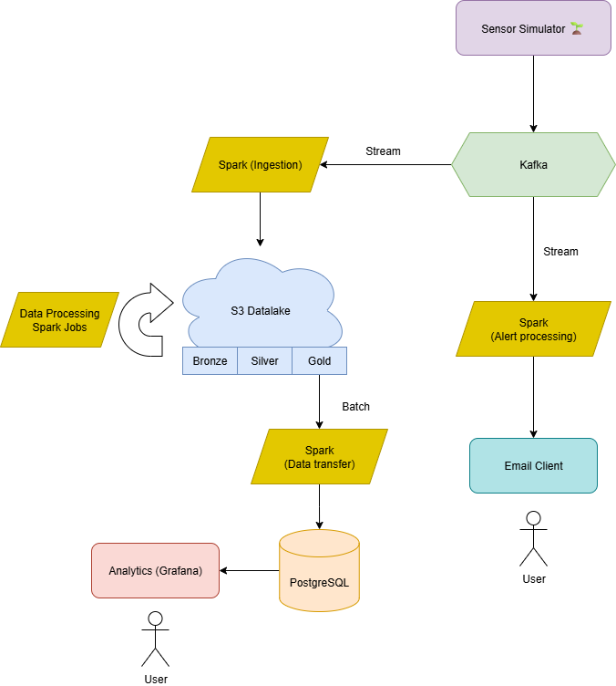

# 🌱 Data Engineering Project 

In a world where food security is paramount, this project aims to enhance agricultural productivity and sustainability through advanced data engineering techniques.

This project is a scalable, containerized data engineering platform for **sensor data ingestion**, **stream processing**, and **alert detection**, built with **Apache Kafka**, **Apache Spark** and **Grafana**, with **AWS S3** and **PostgreSQL** as storage. **Docker** and **Docker compose** are used for conterinerization and orchestration.

---

## 📌 Overview

This project simulates and ingests IoT sensor data into Kafka, processes it via Spark Streaming jobs through bronze-silver-gold stages, and detects anomalies. It includes:
- **Data Pipeline**: Kafka → Spark → S3
- **Alerting Pipeline**: Spark jobs identify and forward anomalies
- **Monitoring**: Grafana dashboards fed from processed data
- **Simulation**: A `sensor-simulator` service generates test data

---

## 📊 Architecture



---

## 📂 Project Structure (Simplified)

```
alerting-pipeline/
  └── spark/                               # Contains Core logic for alerts
data-pipeline/
  └── spark/
      ├── src/main/scala/ingestion/        # Spark ingestion logic
      |    └── KafkaIngest.scala
      └── src/main/scala/processing/       # Contains data processing / grafana Spark jobs
          ├── BronzeJob.scala
          ├── SilverJob.scala
          ├── GoldJob.scala
          └── GrafanaExportJob.scala
sensor-simulator/                          # Core data simulation logic
  └── src/main/scala/
      └── Producer.scala
scripts/                                   # Helper scripts
  ├── master-workflow.sh
  └── ...
docker/                                    # Dockerfiles and Compose files             
  ├── docker-compose.yml
  └── docker-compose.pipeline.yml
docker-compose.unified.yml                 # Unified Main Docker Compose for all services
```

---

## 🔁 Data Pipeline Breakdown

### 🟠 Ingestion (Bronze Layer)
- **Script**: `KafkaIngest.scala`
- **Function**: Reads raw sensor data from Kafka and stores it in the **Bronze S3 layer**.

### ⚪ Transformation (Silver Layer)
- **Script**: `SilverJob.scala`
- **Function**: Cleans and enriches Bronze data, stores in **Silver S3 layer**.

### 🟡 Aggregation (Gold Layer + Alerts)
- **Script**: `GoldJob.scala`
- **Function**:
  - Aggregates Silver data to generate key metrics.
  - Exports data for Grafana dashboards.

---

## 🚨 Alert Pipeline

- **Input**: Kafka topic with sensor data
- **Detection Logic**: Encoded in `KafkaAlertingPipeline.scala`
- **Outputs**:
  - Alert messages to an email client

---

## 📦 Services

| Service      | Description                      |
|--------------|----------------------------------|
| Kafka        | Data broker and streaming   |
| Spark        | Streaming / Batch job executor           |
| Zookeeper   | Kafka cluster management         |
| Grafana      | Dashboard visualization          |
| Sensor Sim   | Data generation (simulator)      |
| AWS S3     | Data lake storage      |
| PostgreSQL   | Analytics storage                |
| Alerting Pipeline | Anomaly detection and alerting |

---

## ⚙️ Setup

### 1. ✅ Prerequisites
- Docker + Docker Compose
- AWS credentials (for S3 access)
- JDK 8+ and Scala

### 2. 📁 Configure `.env`

Copy and edit:
```bash
cp .env.example .env
```

Fill in your AWS, Kafka/Spark and SMTP email variables.

### 3. 🚀 Run the Data Pipeline

The `./scripts/master-workflow.sh` script orchestrates the entire pipeline, including building the docker images, starting services and running the jobs.

```bash
# Run master workflow script
./scipts/master-workflow.sh
```

---

## 📈 Monitoring & Visualization

### Grafana Setup

- Runs at: [http://localhost:3000](http://localhost:3000)
- Default credentials: `admin / admin`
- Dashboards auto-loaded from `grafana-config/dashboard-model.json`

### Alert setup

- Configure SMTP variables in `.env` to receive email alerts.
- Alerts are sent to the configured email when thresholds are breached.
- Alert detection logic is in `KafkaAlertingPipeline.scala`.

---

## ☁️ Data Lake

- Data is written to `s3://inde-aws-datalake/` via AWS credentials.
- You can access structured layers:
  - `/bronze/`
  - `/silver/`
  - `/gold/`
- Supports real AWS S3 bucket

---


## 🔧 Useful Scripts

| Script                         | Purpose                            |
|--------------------------------|------------------------------------|
| `start-services.sh`           | Bootstraps all core services       |
| `run-pipeline.sh`             | Runs full Spark-based pipeline     |
| `build-containers.sh`       | Builds all Docker containers       |
| `build-and-run-spark-ingest.sh` | Build + run Spark ingestion       |
| `run_pipeline_scheduled.sh`   | Runs pipeline periodically         |
| `log-messages.sh`             | Reads logs from Kafka              |
| `produce-test-messages.sh` | Produces test message to Kafka   |

---

## 🧑‍💻  Development Team

Cédric Damais \
Yacine Benihaddadene \
Gabriel Calvente \
Léon Ayral

---

## 📄 License

MIT License
