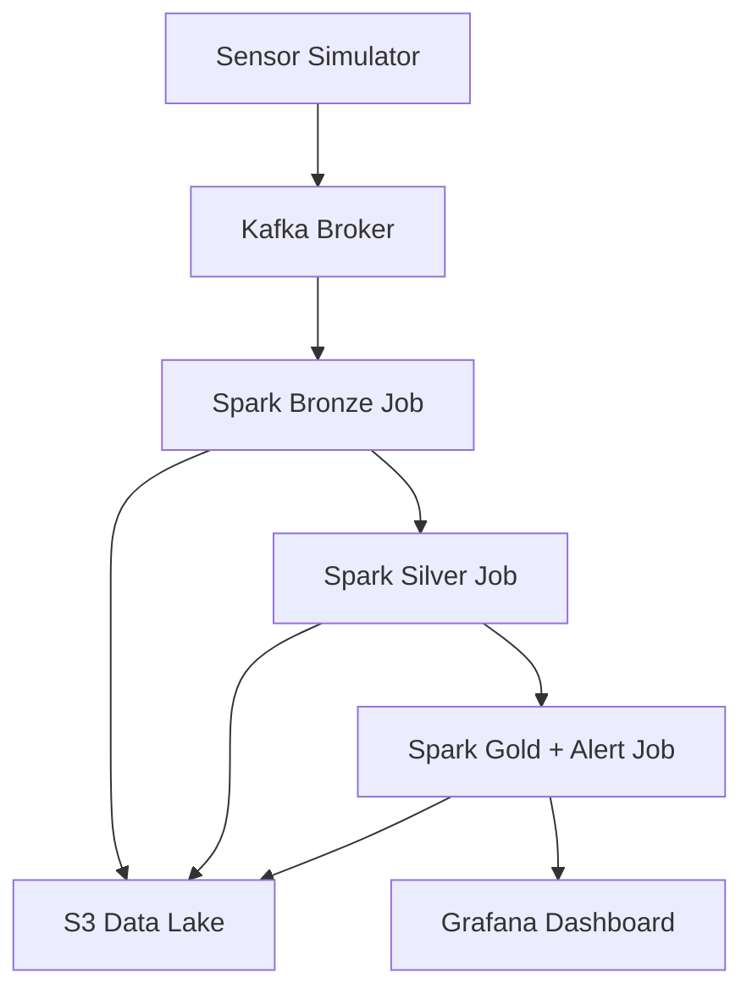

# 🌱 Data Engineering Project 

In a world where food security is paramount, this project aims to enhance agricultural productivity and sustainability through advanced data engineering techniques.

It is a scalable, containerized data engineering platform for **sensor data ingestion**, **stream processing**, and **alert detection**, built with **Apache Kafka**, **Apache Spark**, **Flink**, and **Grafana**, with data flowing to an **S3-based data lake**.

---

## 📌 Overview

This project simulates and ingests IoT sensor data into Kafka, processes it via Spark Streaming jobs through bronze-silver-gold stages, and detects anomalies. It includes:
- **Data Pipeline**: Kafka → Spark → S3
- **Alerting Pipeline**: Spark jobs identify and forward anomalies
- **Monitoring**: Grafana dashboards fed from processed data
- **Simulation**: A `sensor-simulator` generates test data

---

## 📊 Architecture



---

## 📂 Project Structure (Simplified)

```
data-pipeline/
  └── spark/
      ├── src/main/scala/ingestion/KafkaIngest.scala
      └── src/main/scala/processing/
          ├── BronzeJob.scala
          ├── SilverJob.scala
          ├── GoldJob.scala
          ├── AlertDetection.scala
          └── GrafanaExportJob.scala
[INSERT ALERT PIPELINE HERE]
sensor-simulator/
  └── src/main/scala/
      └── Producer.scala

scripts/
  ├── run-pipeline.sh
  └── run-spark-job.sh

docker/
  ├── docker-compose.yml
  └── docker-compose.pipeline.yml
```

---

## 🔁 Data Pipeline Breakdown

### 🟠 Ingestion (Bronze Layer)
- **Script**: `KafkaIngest.scala`
- **Function**: Reads raw sensor data from Kafka and stores it in the **Bronze S3 layer**.

### ⚪ Transformation (Silver Layer)
- **Script**: `SilverJob.scala`
- **Function**: Cleans and enriches Bronze data, stores in **Silver S3 layer**.

### 🟡 Aggregation (Gold Layer + Alerts)
- **Script**: `GoldJob.scala`, `AlertDetection.scala`
- **Function**:
  - Aggregates Silver data to generate KPIs.
  - Runs alert rules (e.g., threshold breaches).
  - Exports data for Grafana dashboards.

---

## 🚨 Alert Pipeline

- **Input**: Processed data from Silver Layer
- **Detection Logic**: Encoded in `AlertDetection.scala`
- **Outputs**:
  - Alert messages to a Kafka topic (optional)
  - Structured data to S3 and Grafana

---

## 📦 Services

| Service      | Description                      |
|--------------|----------------------------------|
| Kafka        | Messaging system for ingestion   |
| Spark        | Streaming job executor           |
| Grafana      | Dashboard visualization          |
| Sensor Sim   | Data generation (simulator)      |
| S3 (mock)    | Data lake (minio or real S3)     |
| Flink (stub) | Placeholder for stream jobs      |

---

## ⚙️ Setup

### 1. ✅ Prerequisites
- Docker + Docker Compose
- AWS credentials (for S3 access)
- JDK 8+ and Scala (if building manually)

### 2. 📁 Configure `.env`

Copy and edit:
```bash
cp .env.example .env
```

Fill in your AWS and Kafka/Spark variables.

### 3. 🐳 Build and Run Containers

```bash
# Build all containers
./scripts/build-containers.sh

# Start Kafka, Zookeeper, Spark Master/Workers, Grafana
docker-compose -f docker/docker-compose.yml up -d

# Run full pipeline setup (Kafka, Spark jobs)
docker-compose -f docker/docker-compose.pipeline.yml up -d
```

---

## 🚀 Run the Data Pipeline

### Start Kafka & Spark Jobs
```bash
./scripts/start-kafka.sh
./scripts/run-pipeline.sh
```

Or run jobs individually:
```bash
./scripts/run-spark-job.sh bronze
./scripts/run-spark-job.sh silver
./scripts/run-spark-job.sh gold
```

### Simulate Sensor Data
```bash
cd sensor-simulator
sbt run
```

---

## 📈 Monitoring & Visualization

### Grafana Setup

- Runs at: [http://localhost:3000](http://localhost:3000)
- Default credentials: `admin / admin`
- Dashboards auto-loaded from `grafana-config/dashboard-model.json`

---

## ☁️ Data Lake

- Data is written to `s3://inde-aws-datalake/` via AWS credentials.
- You can access structured layers:
  - `/bronze/`
  - `/silver/`
  - `/gold/`
- Supports real AWS S3 or local mock (e.g. MinIO)

---

## 🧪 Testing

Includes test Kafka producer and integration test:

```bash
./scripts/produce-test-message.sh
```

---

## 🔧 Useful Scripts

| Script                         | Purpose                            |
|--------------------------------|------------------------------------|
| `start-services.sh`           | Bootstraps all core services       |
| `run-pipeline.sh`             | Runs full Spark-based pipeline     |
| `build-and-run-spark-ingest.sh` | Build + run Spark ingestion       |
| `run_pipeline_scheduled.sh`   | Runs pipeline periodically         |
| `log-messages.sh`             | Reads logs from Kafka              |

---

## 🏗️ Build Spark Jobs (Manually)

```bash
cd data-pipeline/spark
sbt package
```

---

## 🧑‍💻  Core Team

Cédric Damais \
Yacine Benihaddadene \
Gabriel Calvente \
Léon Ayral

---

## 📄 License

MIT License
